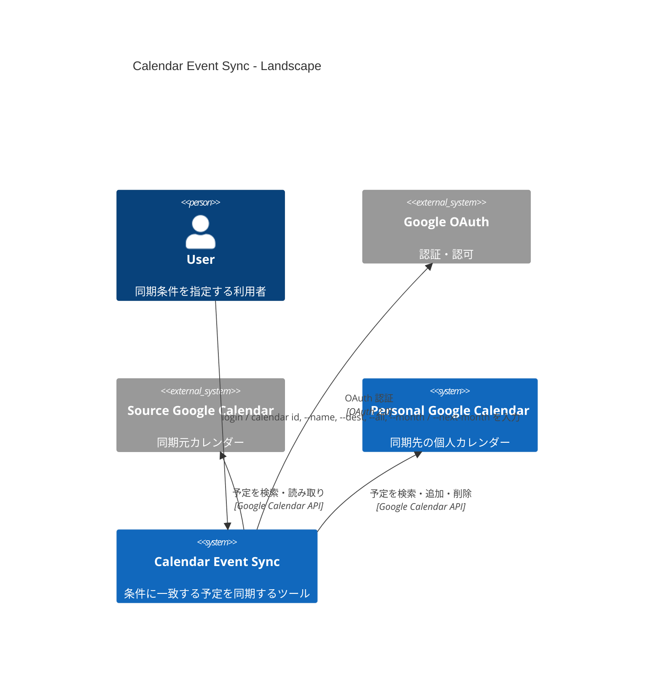
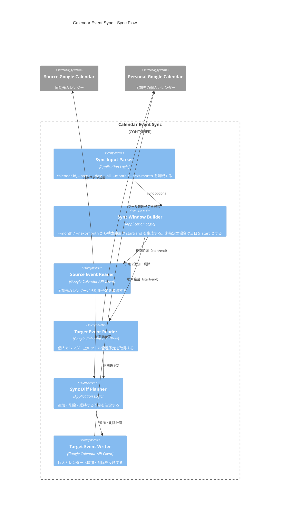
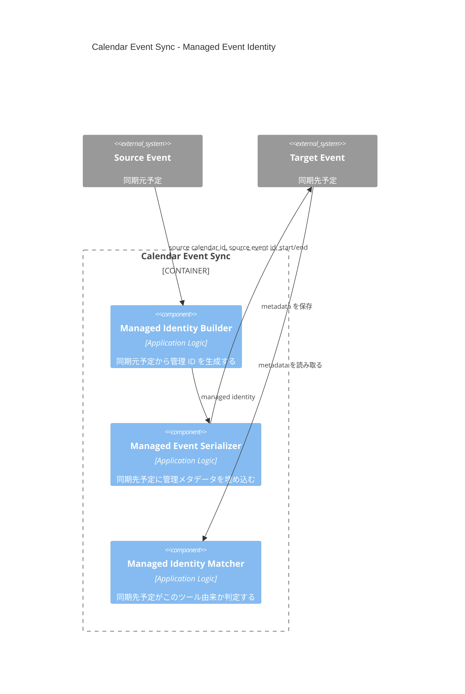

# DesignDoc: Calendar Event Sync

**Document Status:** Draft
**Development Status:** TBD

## Abstract/Summary

この DesignDoc は、指定されたカレンダー ID から、予定名と同期範囲に該当する予定を個人カレンダーへ同期する仕組みを説明する。同期先には、同期元に存在する予定だけが存在する状態を保ち、差分は sync 済み予定の編集ではなく、既存予定を削除して再度追加する「置き換え」として扱う。

`--all` 未指定の場合は当日以降で最も近い合致予定 1 件のみを同期する。  
`--name` 未指定の場合はすべての予定が同期対象になるため警告を表示してユーザー確認を取る。

### CLI

```
# Login with Google
gcal-sync login

# Sync events to personal (or specified) calendar
gcal-sync <src calendar id> [--dest <dest calendar id>] [--name <sync event name>] [--all] [--month YYYYMM] [--next-month]
```

### Sync Input

| 項目 | 必須 | 説明 |
| --- | --- | --- |
| src calendar id | 必須 | 同期元の Google Calendar ID |
| `--dest` / `-d` | 任意 | 同期先のカレンダー ID<br/>未指定の場合はプライマリカレンダー |
| `--name` | 任意 | 同期対象の予定名（完全一致）<br/>未指定の場合はすべての予定が対象になるため警告を表示し、y/n をプロンプトで確認する |
| `--all` | 任意 | 一致する予定をすべて同期する<br/>未指定の場合は当日以降で開始予定が最も近い 1 件のみ同期する |
| `--month` | 任意 | 同期範囲を特定の月に絞る（YYYYMM 形式）<br/>未指定の場合は範囲制限なし |
| `--next-month` | 任意 | `--month` に翌月を指定する省略形 |

### Sync Result

| 状態                                                       | 処理                                       |
| ---------------------------------------------------------- | ------------------------------------------ |
| 同期元にあり、同期先に同一予定がない                       | 同期先に追加する                           |
| 同期元にあり、同期先に同一予定がある                       | 何もしない                                 |
| 同期元に同一予定がなく、<br/>同期先にこのツール由来の予定がある | 同期先から削除する                         |
| 同期元の予定内容が変わった                                 | 既存予定を削除し、新しい予定として追加する |

## Background

複数の Google Calendar を使っている場合、共有カレンダーや外部カレンダーにある特定の予定だけを、自分の個人カレンダーへ反映したいことがある。

通常のカレンダー購読では、カレンダー全体が表示対象になり、予定名や期間による細かい同期制御がしづらい。また、予定を単純にコピーするだけでは、同期元で削除・変更された予定が同期先に残り続ける。

## Goals

- 共有カレンダーや外部カレンダーから、条件に合う予定だけを個人カレンダーへ反映できる
- 同期元の変更（削除・更新）を個人カレンダーに追従させる
- ツールが管理している予定とユーザー自身の予定を区別し、ユーザーの手動予定には影響を与えない
- 予定名や期間など、ユーザーが指定する条件で同期対象を細かく制御できる
- 意図しない大量同期を防ぐため、操作内容をユーザーが事前に確認できる

## Lower-Priority Goals

- 複数の予定名条件を指定できるようにする
- 予定名の完全一致以外に、前方一致・部分一致・正規表現を選べるようにする
- 複数の同期元カレンダーを一度に扱えるようにする
- 定期実行や自動同期を提供する
- dry-run によって、追加・削除予定の一覧だけを確認できるようにする

## Non-Goals

- Google Calendar 全体の双方向同期
- 同期先で編集された予定を同期元へ反映すること
- 同期元以外で作られた個人予定の削除
- 出欠回答、会議室、ゲスト招待の完全な再現
- Google Calendar API の関数単位の仕様説明
- 日付 range による任意期間 sync
- 複数 month をまたぐ sync

## Proposed Design

実行単位は CLI とする。ユーザーは `login` で Google OAuth 認証を行い、その後 sync コマンドで同期を実行する。

sync コマンドは `--month` / `--next-month` で対象月を絞ることができ、未指定の場合は制限なし（当日以降）で動作する。`--all` 未指定の場合は当日以降で開始予定が最も近い 1 件のみを同期する。`--name` 未指定の場合はすべての予定が対象になるため警告を表示し y/N で確認を取る。`--name` と `--month` の両方が未指定の場合、および `--month` 未指定かつ `--all` 指定の場合はエラーとして終了する。

この機能は、同期元カレンダーを読み取り、条件に合う予定を抽出し、個人カレンダー上のツール管理予定と比較して同期状態を揃える。

### Landscape



### Login

`gcal-sync login` を実行すると、ブラウザで Google OAuth 認証フローを開始する。認証完了後、取得したトークンをローカルに保存する。以降の sync コマンドはこのトークンを使って Google Calendar API を呼び出す。

### Sync Flow

Sync Flow は、入力オプションを検証し Sync Window を生成したうえで、同期元と同期先を比較して差分を適用する。



Sync Flow は、次の順序で処理する。

1. `--month` 未指定かつ `--all` 指定の場合はエラーを表示して終了する
2. `--name` 未指定かつ `--month` 未指定の場合はエラーを表示して終了する
3. `--month` / `--next-month` から Sync Window を生成する。未指定の場合は当日を start とし、end は無制限とする
4. Sync Window 内について、同期元カレンダーから `--name` に一致する予定を取得する。`--name` 未指定の場合は全予定を取得する
5. `--all` 未指定の場合は、取得した予定の中から当日以降で開始予定が最も近い 1 件のみを対象とする
6. 個人カレンダーから、このツールが作成した予定を取得する
7. 同期元予定と同期先予定を比較し、追加・削除対象を決める
8. `--name` 未指定の場合は警告・変更予定を表示し y/N プロンプトで確認を取る。N の場合は中断する
9. 削除を先に実行し、その後に追加を実行する

削除を先に行うことで、変更された予定を「置き換え」として扱いやすくする。

#### テスト戦略

- `--month` 未指定かつ `--all` 指定の場合にエラーで終了することをテストする
- `--name` 未指定かつ `--month` 未指定の場合にエラーで終了することをテストする
- `--month` の start/end が正しく生成されることをテストする
- `--next-month` が翌月の start/end を生成することをテストする
- `--month` 未指定の場合に当日を start とすることをテストする
- `--all` 未指定の場合に当日以降で開始予定が最も近い 1 件のみが同期対象になることをテストする
- `--all` 指定の場合に一致する全件が同期対象になることをテストする
- 同期元にのみ存在する予定が追加対象になることをテストする
- 同期先にのみ存在するツール管理予定が削除対象になることをテストする
- 同期元と同期先に同一予定がある場合、何もしないことをテストする
- 同期元の予定内容が変更された場合、削除と追加の組み合わせになることをテストする

### Managed Event Identity

このツールで作成した予定かどうかは、同期先予定に保存する管理用メタデータで判定する。



管理メタデータは `extendedProperties`（private fields）と説明欄の両方に保存する。真とみなす値は `extendedProperties` とし、説明欄への埋め込みは人間が確認しやすくするための補助として扱う。

同期先予定には、少なくとも次の情報を保存する。

| 項目               | 説明                                           |
| ------------------ | ---------------------------------------------- |
| sync tool marker   | このツールが作成した予定であることを示す識別子 |
| source calendar id | 同期元カレンダー ID                            |
| source event id    | 同期元予定 ID                                  |
| source start/end   | 同期元予定の開始・終了                         |
| source fingerprint | 同期元予定の内容から作る比較用 fingerprint     |

source fingerprint は、予定の同一性を判定するための値である。予定名（完全一致）、開始日時、終了日時、終日予定かどうか、の組み合わせから生成する。

同期元に同じ source event id がある場合でも、fingerprint が異なる場合は同一予定とはみなさない。この場合、同期先の既存予定を削除し、新しい予定を追加する。

繰り返し予定については現行バージョンでは考慮しない。繰り返し予定の各 occurrence は個別に同期対象とはならず、動作は未定義とする。

#### テスト戦略

- ツール管理メタデータを持つ予定だけが削除対象になることをテストする
- 同じ source event id でも fingerprint が異なる場合、置き換え対象になることをテストする
- ユーザーが手動作成した同名予定が削除されないことをテストする

### Event Matching

同期対象の予定は、`--name` と Sync Window によって絞り込む。

`--name` と `--month` の両方が未指定の場合はエラーとして終了する。

予定名の一致ルールは完全一致とする。`--name` が未指定の場合は、Sync Window 内のすべての予定が対象となる。その場合は diff 計算後に以下の警告と変更予定を表示し、y/N プロンプトでユーザー確認を取る。

```
--name is not specified.

This operation will sync ALL events from:
calendar: <src calendar id>
month: YYYY-MM

Planned changes:
+ add:    N events
- delete: N events

Are you sure? [y/N]:
```

`--all` が未指定の場合は、一致した予定の中から当日以降で開始予定が最も近い 1 件のみを同期対象とする。

`--month` 未指定かつ `--all` 指定の組み合わせはエラーとし、メッセージを表示して終了する。

同期先の同一判定では、表示上の予定名だけに依存しない。同一性は管理メタデータと fingerprint で判断する。

#### テスト戦略

- `--name` が完全一致した予定だけが同期対象になることをテストする
- `--name` 未指定かつ `--month` 未指定の場合にエラーで終了することをテストする
- `--name` 未指定時に diff 計算後に警告・変更予定・y/N プロンプトが表示されることをテストする
- `--name` 未指定で N を選択した場合に同期が中断されることをテストする
- `--all` 未指定の場合に当日以降で開始予定が最も近い 1 件のみが対象になることをテストする
- 同期先予定名が異なっていても、管理メタデータによって同期対象として扱えることをテストする

## Alternatives Considered

### 同期先の予定名だけで管理対象を判定する

予定名が一致する予定を削除対象にする案。

**選定しなかった理由:** ユーザーが手動で作成した同名予定を誤って削除する危険がある。

### 同期元予定の変更を update で反映する

同期元予定に変更があった場合、同期先予定を直接更新する案。

**選定しなかった理由:** 初期設計では、削除と追加による置き換えのほうが同期状態を単純に保てる。

### ユーザーの個人予定も含めて完全一致で重複判定する

ツール管理メタデータがない予定でも、内容が完全一致すれば既存予定として扱う案。

**選定しなかった理由:** 重複作成を避けられる一方で、後続の削除・置き換え対象として扱うべきかが曖昧になる。初期設計では、削除対象はツール管理予定に限定する。

## Open Questions

- 削除・追加の途中で失敗した場合、次回同期で復旧できる設計にするか。
